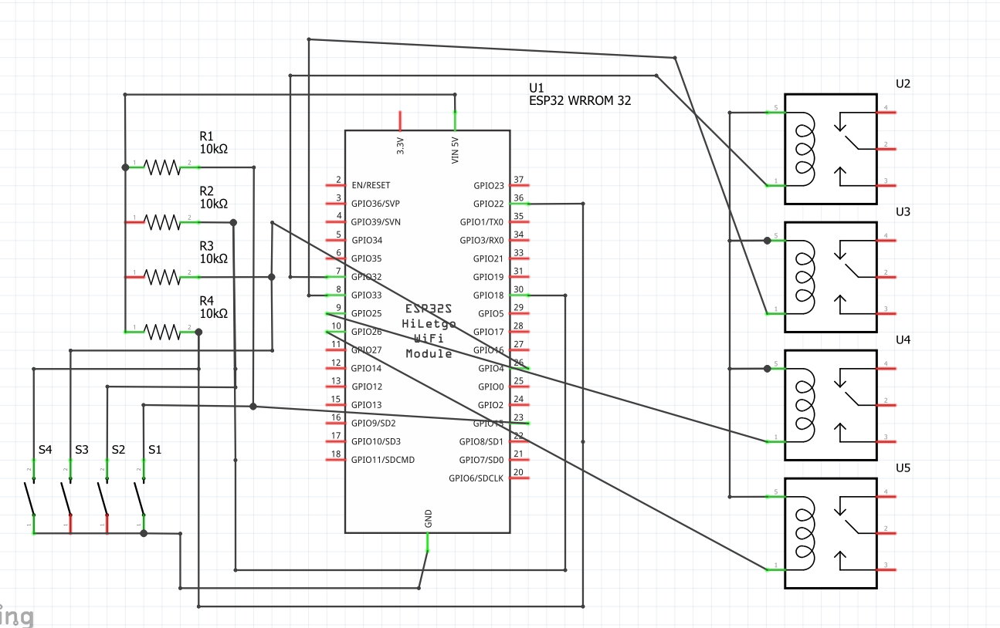
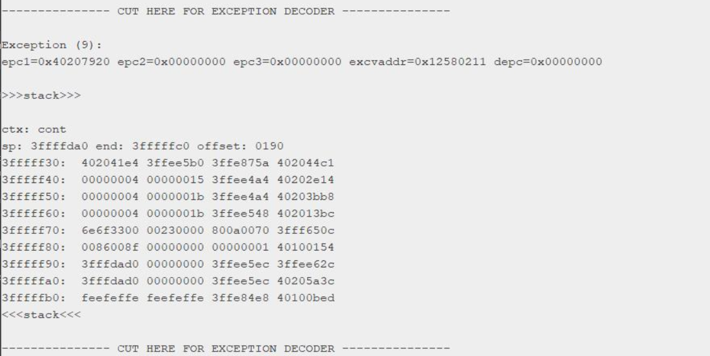

<h1>VOICE CONTROLLED HOME AUTOMATION</h1>

<h2>Description</h2>

In this project, I have used the ESP-32 micro-controller along with this 4 channel low level trigger to control the appliances with the help of the signal incoming from micro-controller.In this we have designed to control 4 bulbs and controlling facility consist of buttons,WIFI and Bluetooth.In WIFI module we have added the functionality of controlling the appliances by voice and web page.Our purpose of this project is to provide the ease for human being especially for disabled people.The interesting thing of this project is whenever you go out of your home and forget to switch off the lights,fans whatever you can easily switch off it and also when you are coming to your home before your arrival you can on the lights AC etc.

<h2>Softwares/Languages Used</h2>
- (HTML, CSS, javascript) for web page
- PHP and MYSQL database
- Dialogflow and Google Assistant for voice commands
- Serial Bluetooth Terminal app for Bluetooth control

<h2>Flow Diagram</h2>
![flow diagram][images/flowdiagram.png]

<h2>Schematic Diagram</h2>

<h2>Problems, Bugs and Troubleshooting</h2>

We faced two main problems while making our project:

1. Watchdog timer reset

The biggest problem I faced was that, after some time the microcontroller automatically restarts and  following message was printed on the serial monitor.

This was a serious issue in my project because it causes all of the 4 appliances to restart that are to be connected in place of bulbs. To solve this issue we searched lot on google (approx 2 weeks) but found no working solution. We also changed the microcontroller from ESP8266 to ESP32 but still getting the same problem. There was also no problem in our code logic. Then we found some thing called “ESP Exception decoder” on the internet, through this we were finally able to figure out where the problem was. The problem was in one of the libraries that we were using in our code. The name of the library was “StringSplitter.h”. After removing this library the project was working fine.

